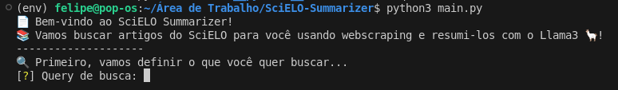

# SciELO-Summarizer

[PT-BR] Este projeto foi desenvolvido durante o [Summer Institute in Computational Social Sciences (SICSS) 2024, Brazil](https://sicss.io/2024/fgv-ecmi-brazil/). Siga as instruções em português [aqui](#introdução-pt).


[EN] This project was developed during the [Summer Institute in Computational Social Sciences (SICSS) 2024, Brazil](https://sicss.io/2024/fgv-ecmi-brazil/). Follow the instructions in English [here](#introduction-en).


# [Introdução [PT]](#introdução-pt)

Ele consiste em um sumarizador de artigos científicos em português. O projeto faz o scraping do conteúdo do artigo no site da SciELO e gera um sumário personalizado para o usuário utilizando Large Language Models (LLMs), especificamente o Llama3.

Para rodar o projeto localmente, você precisa ter tanto o Python 3.8 ou superior quanto o Llama3 instalado. Também é possível rodar o projeto no Google Colab, seguindo este [link](https://colab.research.google.com/drive/1iwNWhNh3KhchKre6p6Kl8Dw55t30Zp-7?usp=sharing).

## Rodando o projeto no Google Colab

Para rodar o projeto no Google Colab, você pode usar o seguinte [link](https://colab.research.google.com/drive/1iwNWhNh3KhchKre6p6Kl8Dw55t30Zp-7?usp=sharing). Isso abrirá o projeto no Google Colab, e você poderá rodar as células para gerar os sumários.

Siga as instruções no notebook para rodar o projeto. Por exemplo, você precisará fazer o upload do arquivo [`utils.py`](src/utils.py) para o ambiente do Colab para rodar o projeto.

## Rodando o projeto localmente

### Instalando as dependências

Para instalar as dependências, rode o seguinte comando:

```bash
pip install -r requirements.txt
```

### Instalação do Llama3

Este projeto utiliza o modelo Llama3, um Large Language Model (LLM) de última geração desenvolvido pela Meta. Nós instalamos o modelo utilizando o pacote `ollama`, que é um wrapper em Python para o Llama3. Para instalar o `ollama`, rode o seguinte comando:

```bash
pip install ollama
```

Depois de instalar o `ollama`, você pode baixar o modelo Llama3 seguindo as instruções no [repositório oficial](https://github.com/ollama/ollama?tab=readme-ov-file). As instruções podem variar dependendo do seu sistema operacional.

### Rodando o projeto

Para rodar o projeto, execute o seguinte comando:

```bash
python main.py
```

Este comando iniciará o programa, e você será solicitado a inserir a consulta de pesquisa.



Você também será solicitado a inserir o número de artigos que deseja extrair, o critério de ordenação e o intervalo de tempo. Você também pode escolher entre os métodos de sumarização disponíveis. Isso contém a opção de sumarizar o artigo usando o texto completo, ou sumarizar o artigo seção por seção.

Você também pode inserir um link para um servidor remoto (que deve ter o modelo Llama3 instalado) para rodar a sumarização. Isso é especialmente útil se você deseja rodar o projeto em um servidor com mais poder computacional. Mas lembre-se de que é possível utilizar o Google Colab, conforme mencionado anteriormente.

Ao final da execução, o programa gerará um sumário dos artigos e gerará um arquivo .xlsx com os sumários, que pode ser encontrado na pasta `resumos`.

--- 

# [Introduction [EN]](#introduction-en)

This project was developed during the [Summer Institute in Computational Social Sciences (SICSS) 2024, Brazil](https://sicss.io/2024/fgv-ecmi-brazil/).

It consists of a summarizer for scientific articles in Portuguese. It scrapes the content of the article from the SciELO website and generates a personalized summary for the user using Large Language Models (LLMs), especifically Llama3.

To run the project locally, you need to have both Python 3.8 or higher and Llama3 installed. It is also possible to run the project on Google Colab, following this [link](https://colab.research.google.com/drive/1iwNWhNh3KhchKre6p6Kl8Dw55t30Zp-7?usp=sharing).

## Running the project on Google Colab

To run the project on Google Colab, you can use the following [link](https://colab.research.google.com/drive/1iwNWhNh3KhchKre6p6Kl8Dw55t30Zp-7?usp=sharing). This will open the project in Google Colab, and you can run the cells to generate the summaries.

Follow the instructions in the notebook to run the project. For instance, you will need to upload the [`utils.py`](src/utils.py) file to the Colab environment to run the project.

## Running the project locally

### Install dependencies

To install the dependencies, run the following command:

```bash
pip install -r requirements.txt
```

### Llama3 installation

This project uses the Llama3 model, a state-of-the-art Large Language Model (LLM) developed by Meta. We installed the model using the `ollama` package, which is a Python wrapper for Llama3. To install `ollama`, run the following command:

```bash
pip install ollama
```

Aftar installing `ollama`, you can download the Llama3 model following the instructions in the [official repository](https://github.com/ollama/ollama?tab=readme-ov-file). The instructions may vary depending on your operating system.

### Running the project

To run the project, execute the following command:

```bash
python main.py
```

This command will start the program, and you will be prompted to enter the search query.


You will also be prompted to enter the number of papers you want to extract, the sortin criteria and the time range. You can also choose between the summarization methods available. This contains the option of summarizing the paper using the full text, or summarizing the paper section by section. 

You can also input a link to a remote server (which should have the Llama3 model installed) to run the summarization. This is especially useful if you want to run the project on a server with more computational power. But remember that you can use Google Colab, as mentioned earlier.

By the end of the execution, the program will generate a summary of the articles and output an .xlsx file with the summaries, which can be found in the `resumos` folder.